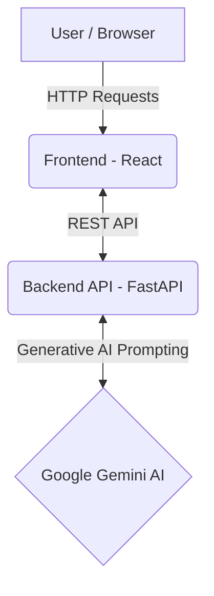
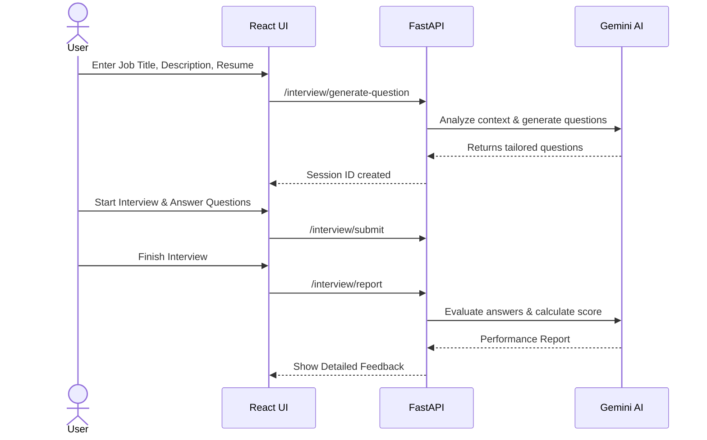

# Smart AI Tech Interviewer

A next-generation, AI-powered interview preparation platform. This application leverages the power of Gemini AI to help users practice and refine their interview skills through personalized question generation, real-time feedback, and automated performance evaluation.

<p>
  
  
  
  
</p>

---

## Architecture and Tech Stack



- **Backend:** FastAPI (Python)
- **Frontend:** ReactJS
- **AI Engine:** Google Gemini AI
- **Infrastructure:** Docker & Docker Compose

---

## Core Features



- **Dynamic Question Generation:** Automatically generate scenario-based and skill-specific questions based on the candidate's resume, job title, and job description.
- **Interactive Sessions:** Progress through an interview at your own pace, skipping or answering questions as needed.
- **Detailed Evaluation:** Receive a comprehensive feedback report highlighting strengths, areas for improvement, and an overall percentage score.

---

## Getting Started

### Prerequisites

- Docker & Docker Compose
- Or Python 3+ and NodeJS (for manual setup)
- A valid Google Gemini API Key

### Configuration

Create a `.env` file in the root directory (or update the existing one):

```env
GEMINI_API_KEY=your_gemini_api_key_here
```

### Run with Docker (Recommended)

To launch the entire platform in isolated containers:

```bash
docker compose up -d
```

### Run Manually

**Start the Backend API:**
```bash
cd ai_interview_service
python3 -m venv venv
source venv/bin/activate  # Or `venv\Scripts\activate` on Windows
pip install -r requirements.txt
fastapi dev main.py
```

**Start the Frontend UI:**
```bash
cd ai_interview_frontend
npm install
npm start
```

---

## Accessing the Platform

- **Frontend (React UI):** [http://localhost:3000/](http://localhost:3000/)
- **Backend Swagger Docs:** [http://localhost:8000/docs](http://localhost:8000/docs)
